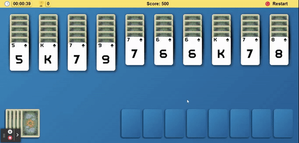

# Reversed Spider Solitaire
## Live Demo
https://reversed-spyder-solitaire.herokuapp.com/

## Content

- [Technologies Used](#technologies-used)
- [Installation](#installation)
- [Previews](#previews)

## Technologies Used
- ReactJS
- Styled Components
- React Beautiful DND (Drag and Drop)
- Jest
- Cypress
- ESLint
- Heroku

## Installation
- Clone project
```sh
git clone https://github.com/alibalbars/reversed-spider-solitaire-ali-balbars.git
```

``` bash
# install dependencies
npm install

# start with hot reload at localhost:3000
npm start

# build for production with minification
npm run build
```
## Previews
### Gameplay

### Main

### Deal

### Restart

### You won
